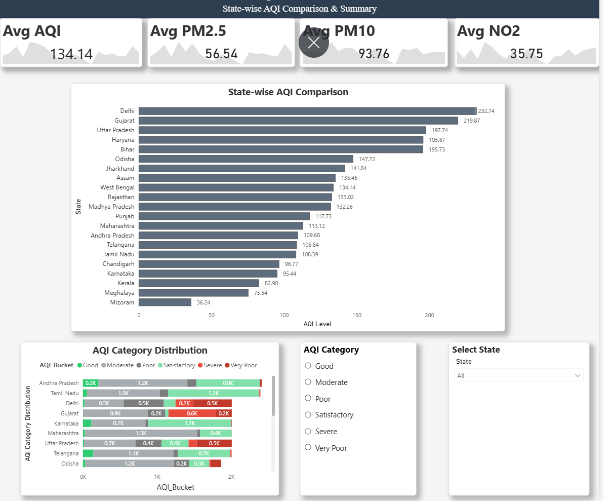

# Air Quality Analysis and Visualization

## Project Overview
This project focuses on analyzing and visualizing air quality data collected from different cities. The main goal is to understand pollution patterns, improve data quality, perform preprocessing, and generate meaningful insights using statistical analysis, visualization, and dimensionality reduction techniques.

The project was developed as part of a **Data Science and Visualization (DSV)** course project.

---

## Dataset
The dataset contains air quality measurements such as:

- PM2.5
- PM10
- NO
- NO₂
- NOx
- NH₃
- CO
- SO₂
- O₃
- Benzene
- Toluene
- Xylene
- AQI (Air Quality Index)
- AQI Category

### Dataset Files
```text
Dataset/
├── city_day.csv
├── cleaned_city_day.csv
├── final_preprocessed_city_day.csv
└── Dashboard_Ready.csv
```

---

## Project Workflow

1. Data Ingestion
2. Data Quality Assessment
3. Data Cleaning
4. Exploratory Data Analysis (EDA)
5. Feature Preprocessing
6. PCA (Principal Component Analysis)
7. State-wise Mapping and Visualization
8. Dashboard Preparation

---

## Folder Structure

```text
.
├── Dataset/
├── Source_code/
│   ├── 01_data_ingestion.ipynb
│   ├── 02_data_quality_report.ipynb
│   ├── 03_data_cleaning.ipynb
│   ├── 05_Feature_Preprocessing.ipynb
│   ├── 06_PCA_Analysis.ipynb
│   ├── 07_state_mapping.ipynb
│   └── eda_statistics/
│       ├── 04_eda_statistics_before.ipynb
│       ├── 04_eda_statistics_After.ipynb
│       └── selected__features_analysis.ipynb
├── REPORTS/
├── Review_PPT/
```

---

## Technologies Used

- Python
- Pandas
- NumPy
- Matplotlib
- Seaborn
- Scikit-learn
- Jupyter Notebook

---

## Key Features

✔ Data quality checking and reporting

✔ Missing value handling and cleaning

✔ Exploratory data analysis

✔ Statistical analysis of air quality indicators

✔ Feature preprocessing

✔ Principal Component Analysis (PCA)

✔ Data visualization and mapping

✔ Dashboard-ready dataset generation

---

## Results

The project helps identify:
- Air pollution trends across cities
- Relationships between pollutants
- Important features influencing AQI
- Reduced-dimensional representations using PCA
- Clean and analysis-ready datasets for visualization

---

## Demo Video

A project demonstration video can be added for reference.

```md
[Watch Demo Video](video&img/demo.mp4)

```

---

## Note

The images and videos included in this repository are provided **only for reference and demonstration purposes** to help users better understand the project workflow and outputs.

---

## Team

Developed by **Team 10** as part of the Data Science and Visualization course project.

---

## Future Improvements

- Real-time AQI monitoring
- Predictive AQI forecasting models
- Advanced geospatial visualizations

---

## License

This project is intended for academic and educational purposes.
